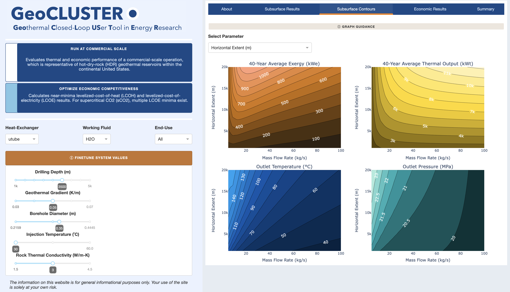

# Welcome to *GeoCLUSTER*

*GeoCLUSTER* (https://geocluster.labworks.org/) is a Python3.8-based web application created using Dash, an open-source framework built on top of Flask that streamlines the building of data dashboards. *GeoCLUSTER* provides users with a collection of interactive methods for streamlining the visualization of the technical and economic modeling of closed-loop geothermal systems.


## Table of Contents

1. [Overview](#overview)
2. [Authors](#authors)
3. [Publications](#publications)
4. [Funding](#funding)
5. [Python Requirements](#requirements)
6. [Run Locally](#local)
7. [Deployment](#deploying)

<br>



<br>

## Overview <a name="overview"></a>

Deep (3- to 10-km depths) geothermal resources with temperatures greater than 150°C are abundant across the continental United States. The ability to numerically predict the thermal performance of geothermal systems, whether they're hydrothermal, enhanced geothermal system (EGS), or closed-loop geothermal systems (CLGSs), has proven invaluable for making informed decisions about the economic viability of proposed systems. **A single techno-economic web application, *GeoCLUSTER* allows start-up developers and venture capitalists to explore the economic viability of closed-loop geothermal systems.**

*GeoCLUSTER* was designed to interactively visualize a large, closed-loop geothermal dataset and detailed numerical simulations. It does so by wrapping a below-ground HDF5 dataset with an above-ground plant and economic model. It uses simple function calls and object construction methods to allow for rapid interpolation and data parsing on the HDF5 dataset (packages: *scipy*, *CoolProp*, *h5py*, *numpy*). Furthermore, all data are preloaded by the application to speed up computations while interactive callbacks streamline its visuals (packages: *dash*, *plotly*). 

Users can explore scenarios on *GeoCLUSTER* through several methods: 1) toggling between the heat-exchanger designs, working fluids, and end-use, 2) optimizing power output and economic competitiveness by clicking on the scenario buttons and moving easy-to-use sliders, and 3) visualizing simultaneous graphics and downloading its data. For example, when a user creates a scenario, the entire application will update to display subsurface and economic results linearly over time, contour representations between a parameter and mass flow rate, and summary tables of fixed and interactive parameter values and their results. A user can then save their scenario by downloading the summary tables and results into a multi-tabbed Excel file.

## Authors <a name="authors"></a>

*GeoCLUSTER* represents the extensive collection of data formatting, processing, and visualization **created by the Closed-Loop Geothermal Working Group (CLGWG)**. CLGWG was a collaborative study involving teams of scientists and engineers from four national laboratories and two universities, plus expert panel members. National labs were Idaho National Laboratory (INL), National Renewable Energy Laboratory (NREL), Sandia National Laboratories (SNL), and Pacific Northwest National Laboratory (PNNL). Universities were Stanford University and Pennsylvania State University.

 


## Publications <a name="publications"></a>

Beckers, K., et al. Closed Loop Geothermal Working Group: GeoCLUSTER App, Subsurface Simulation Results, and Publications. *Geothermal Data Repository*. 2023. ([dataset](https://doi.org/10.15121/1972213))

White, M., et al. Numerical investigation of closed-loop geothermal systems in deep geothermal reservoirs. *Geothermics*. 2024. ([paper](https://doi.org/10.1016/j.geothermics.2023.102852))

## Funding <a name="funding"></a>

This research was funded by the Geothermal Technologies Office (GTO) within the Office of Energy Efficiency and Renewable Energy (EERE) at the U.S. Department of Energy (DOE) to form a collaborative study of closed-loop geothermal systems (CLGSs) involving four national laboratories and two universities. 


## Python Requirements <a name="requirements"></a>

*GeoCLUSTER* runs on **Python version 3.8**, so you will need to create a Python virtual environment that runs Python 3.8.

  

Also, *GeoCLUSTER* most importantly requires **Dash version >=2.9.2**. Dash >=2.9.2 supports [advanced callbacks](https://dash.plotly.com/duplicate-callback-outputs) but it only works in Python 3.8. 

The `requirements.txt` in `dash_app` lists Python packages and their versions needed to run *GeoCLUSTER* following Python installation. Here are those packages listed below:
  
  
  
  
  
  
  
  
  

We suggest your environment reflects these package versions.

## Run *GeoCLUSTER* Locally <a name="local"></a>

Git clone this repository. In terminal (MacOS) or command prompt (Windows), navigate inside the `dash_app` folder and run the application by typing and executing the following:

```
$ python app.py
```

A URL with an IP address including `127.0.0.1` should appear that can be copied and pasted in a browser. `127.0.0.1` is the localhost of your local machine, and the `8060` is the port that is specified in the application:

```
Dash is running on http://127.0.0.1:8060/

 * Serving Flask app 'app'
 * Debug mode: on
```

After launching the application, you should see and be able to interact with *GeoCLUSTER* in the browser. This is only visible to you on your local machine for as long as you are running the script.

 

## Deploying *GeoCLUSTER* <a name="deploying"></a>

### Apache Web Server

A Dash app is a web framework, but without a web server, Dash apps can only run on localhost where only you can access them on your own machine ([see Running *GeoCLUSTER* Locally](#local)). To deploy and share *GeoCLUSTER* with a public IP or domain name, it needs a virtual web server, like Apache. **Apache** is an open-source HTTP server for modern operating systems, and it can communicate over networks from client to server using the TCP/IP protocol. The TCP/IP protocol specifies how devices exchange data over the internet to one another via channels of communication (TPC) and routes and addresses (IP). Apache can be used for a various protocols, but the most common is HTTP/S.

Apache version 2.4.56 is recommended.

  

### WSGI for Forwarding Requests

Apache can communicate over networks but it also needs to communicate with the Python application. **Web Server Gateway Interface (WSGI)** allows web servers to forward requests to web apps or frameworks written in Python. Make sure Apache has `mod_wsgi` installed; if you are installing the Apache module by hand, the file is called 'mod_wsgi.so'. To ensure a successful installation, follow the official [mod_wsgi documentation](https://modwsgi.readthedocs.io/en/develop/index.html) to ensure proper installation. For example, please note this important Python and WSGI installation procedure:

*"Note that the Python virtual environment must have been created using the same base Python version as was used to compile the mod_wsgi module. You can’t use this to force mod_wsgi to somehow use a different Python version than it was compiled for. If you want to use a different version of Python, you will need to reinstall mod_wsgi, compiling it for the version you want. It is not possible for the one mod_wsgi instance to run applications for both Python 2 and 3 at the same time."* ([WSGIDaemonProcess](https://modwsgi.readthedocs.io/en/develop/configuration-directives/WSGIDaemonProcess.html))

### Apache Config File

The **Apache configuration file** then needs to be scripted and the installed WSGI module loaded in the config file so that the WSGI can mediate all communication between the web server and *GeoCLUSTER*.

The Apache config file, `geocluster.ssl.conf`, shows how the Apache config file needs to be set up in order to load and use WSGI, with the most important setup as follows: 

```
LoadModule wsgi_module modules/mod_wsgi.so

<VirtualHost *:8050>

    DocumentRoot    /www/GeoCLUSTER/dash_app
    Timeout 600

    WSGIDaemonProcess Dash threads=1 processes=2 request-timeout=600 socket-timeout=600
    WSGIScriptAlias / /www/GeoCLUSTER/dash_app/wsgi.py process-group=Dash application-group=%{GLOBAL}

    <Directory /www/GeoCLUSTER/dash_app>
        Require all granted
    </Directory>

    <Directory /www/GeoCLUSTER/data>
        Require all granted
    </Directory>

</VirtualHost>
```

If you host multiple Python virtual environments, it might also be best practice to define the `python-home` argument (i.e., the location of the Python virtual environment) in `WSGIDaemonProcess`.

*Note: "If using a Python virtual environment, rather than use [`python-path`] to refer to the site-packages directory of the Python virtual environment, you should use the python-home option to specify the root of the Python virtual environment instead."* ([WSGIDaemonProcess](https://modwsgi.readthedocs.io/en/develop/configuration-directives/WSGIDaemonProcess.html))

```
WSGIDaemonProcess python-home=/var/www/<venv>/lib/python3.8/site-packages
```


### Apache and File Permissions

Permissions will be different across systems, but ensure that the *GeoCLUSTER* directory that hosts the application is readable by Apache. For example, by running the following:

```
chown -Rh apache dash_app
```

In `/usr/local/lib`, which hosts libraries installed (compiled) by yourself, ensure that the Python packages you installed have enough permissions to be read and executed:

```
find /usr/local/lib* -type d -exec chmod 755 {} \;
find /usr/local/lib* -type f -exec chmod o+r {} \;
```


### Python Paths for File Requests

The `wsgi.py` script also mediates communication between Apache and the Python web application. In `wsgi.py`, update the path to the Python virtual environment and to the app directory, for example:

```
site.addsitedir('/var/www/<venv>/lib/python3.8/site-packages') 
sys.path.insert(0, "/var/www/<path>/dash_app")
```

Also, in `paths.py`, define the absolute path to the app directory (`dash_app`) and set it as the absolute_path (L8).

Finally, for errors regarding file requests, especially due to arguments like `url_base_pathname` or `requests_pathname_prefix` when initiating the Dash application in `app.py`, please refer to the `dash.Dash()` documentation is located online on the [Dash API Reference page](https://dash.plotly.com/reference).
