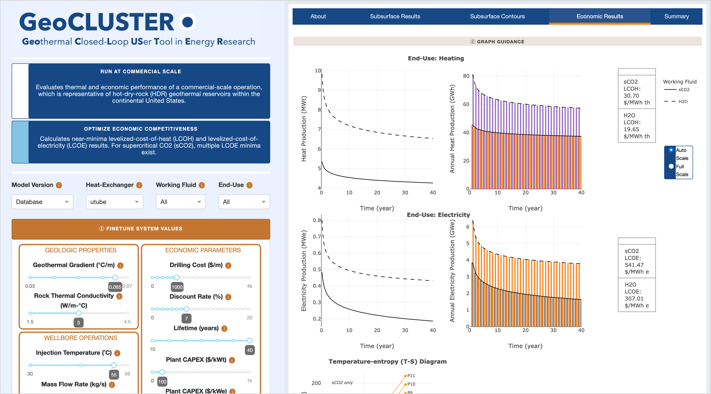
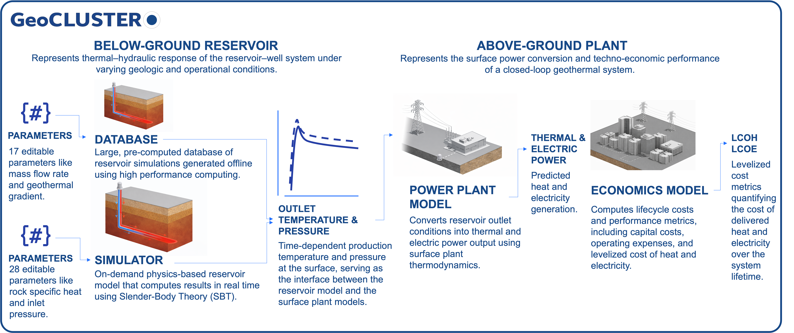
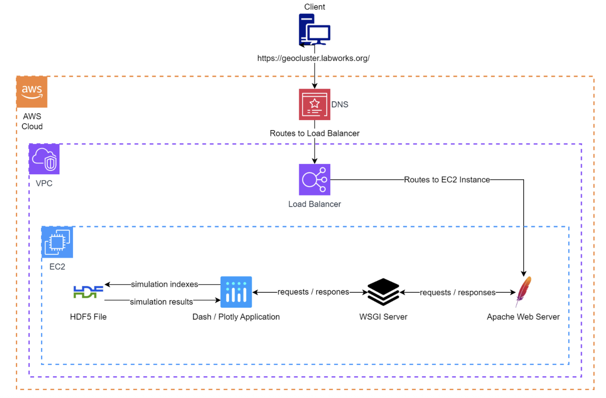

> :warning: **GeoCLUSTER has been moved to openei.org.** Please visit https://apps.openei.org/GeoCLUSTER/ for the lastest version of GeoCLUSTER.

# Welcome to *GeoCLUSTER*

*GeoCLUSTER* (https://geocluster.labworks.org/) is a techno-economic web simulator that enables start-up developers and venture capitalists to explore the economic viability of closed-loop geothermal systems (CLGSs) via computationally fast models and high-quality datasets. *GeoCLUSTER* was created using Python (version >=3.13.5) for its computations and Dash (version >=3.2.0) as its web framework, and the application provides users with a collection of interactive methods for streamlining the exploration of the techno-economic modeling of CLGSs.


## Table of Contents

1. [Overview](#overview)
2. [Models](#models)
3. [Parameters](#parameters)
4. [Python Requirements](#requirements)
5. [Run Locally](#local)
6. [Deployment](#deploying)
7. [API](#API)
8. [Authors](#authors)
9. [Publications](#publications)
10. [Funding](#funding)
11. [Disclaimer](#disclaimer)

<br>



<br>

## Overview <a name="overview"></a>

Deep (3- to 10-km depths) geothermal resources with temperatures greater than 150°C are abundant across the continental United States. The ability to numerically predict the thermal performance of geothermal systems, whether they're hydrothermal, enhanced geothermal system (EGS), or closed-loop geothermal systems (CLGSs), has proven invaluable for making informed decisions about the economic viability of proposed systems. **A single techno-economic web application, *GeoCLUSTER* allows start-up developers and venture capitalists to explore the economic viability of closed-loop geothermal systems.**

*GeoCLUSTER* was designed to interactively visualize a large, closed-loop geothermal dataset and detailed numerical simulations. It does so by enabling users to query, generate and/or visualize closed-loop systems in conduction-only reservoirs (i.e., transfer of heat through direct contact only) via:

1.	A large but compressed, **precomputed HDF5 database of over 2.5 million simulation runs**. The HDF5 database represents the **below-ground** thermal–hydraulic response of the reservoir–well system (i.e., outlet temperature and pressure versus time) and it is combined with an **above-ground plant** and **economic model**. It uses simple function calls and object construction methods to allow for rapid interpolation and data parsing on the HDF5 dataset (packages: *scipy*, *CoolProp*, *h5py*, *numpy*). Furthermore, all data are preloaded by the application to speed up computations while interactive callbacks streamline its visuals (packages: *dash*, *plotly*). Notably, chunking the HDF5 database recently reduced the application’s memory usage by 97% (6.5 GB to 200 MB).

2.	On-the-fly simulations computed by a simulator model, the Slender Body Theory (SBT) v1.0 and v2.0 models, for approximating heat production and profiling pressure over time. **This simulator allows users to create scenarios that were not originally included in the HDF5 database**. For example, users can simulate for depths deeper than 5 km and geothermal gradients larger than 70°C/km, which were originally upper limits in the HDF5 database. And this also includes adding more parameters that users can edit like Rock Specific Heat Capacity and Rock Density. Notably, a recent sparse matrix solution ensures that the application's CPU usage remains below 4%. Similar to the HDF5 database, the outputs of the simulator model are combined with the **same above-ground plant** and **economic model**.

Users can explore scenarios on *GeoCLUSTER* through several methods: 1) toggling between the heat-exchanger designs, working fluids, and end-use, 2) optimizing power output and economic competitiveness by clicking on the scenario buttons, 3) moving easy-to-use parameter sliders, and 4) visualizing simultaneous graphics and downloading their data. For example, when a user creates a scenario, the entire application will update to display subsurface and economic results linearly over time, contour representations between a parameter and mass flow rate, and summary tables of fixed and interactive parameter values and their results. A user can then save their scenario by downloading the summary tables and results into a multi-tabbed Excel file.

 


## Models <a name="models"></a>



## Parameters <a name="parameters"></a>

To better view all possible parameters a user can edit, a full list of editable and fixed parameters is annotated below. For easier readability, parameters are binned into 8 higher-level categories: model fine-tuning, geologic properties, wellbore operations, tube geometry, component performance, power-cycle operations, thermodynamic references, and economics. In total, **32 parameters are editable in GeoCLUSTER**. Parameters annotated with "(fixed)" are not editable but are instead assumptions. Note that more editable parameters are available when a user selects "Simulator" as their model rather than "Database". 

| Model Fine-tuning | Database Options | Simulator Options |
|-----------------|------------------|-------------------|
| Model           | HDF5 Database    | SBT Simulator     |
| Accuracy        | —                | 1 (coarse) to 5 (fine) |
| Mesh Fineness   | —                | 0 (coarse) to 2 (fine) |

| Geologic Properties | Database Options | Simulator Options |
|--------------------|------------------|-------------------|
| Ambient Temperature | 26.85 °C (fixed) | 26.85 °C (fixed) |
| Surface Temperature | 25 °C (fixed) | 0 °C to 40 °C |
| Geothermal Gradient | 0.03 °C/m to 0.07 °C/m | 0.015 °C/m to 0.20 °C/m |
| Rock Thermal Conductivity | 1.5 W/m·°C to 4.5 W/m·°C | 0.4 W/m·°C to 5 W/m·°C |
| Rock Specific Heat Capacity | 790 J/kg·°C (fixed) | 500 J/kg·°C to 2,000 J/kg·°C |
| Rock Density | 2,750 kg/m³ (fixed) | 1,000 kg/m³ to 3,500 kg/m³ |

| Wellbore Operation Parameters | Database Options | Simulator Options |
|------------------------------|------------------|-------------------|
| Working Fluid | H₂O, sCO₂ | H₂O, sCO₂ |
| Mass Flow Rate | 5 kg/s to 100 kg/s | 5 kg/s to 300 kg/s |
| Injection Temperature | 30 °C to 59 °C | 30 °C to 100 °C |
| Inlet Pressure | 200 bar (fixed) | 5 MPa to 20 MPa |
| Mass Flow Rate Mode | — | Constant, Variable |
| Injection Temperature Mode | — | Constant, Variable |
| Fluid Specific Heat Capacity | — | 4,200 J/kg·°C (fixed) |
| Fluid Density | — | 1,000 kg/m³ (fixed) |
| Fluid Thermal Conductivity | — | 0.68 W/m·°C (fixed) |
| Fluid Dynamic Viscosity | — | 600×10⁻⁶ Pa·s (fixed) |

| Tube Geometry Parameters | Database Options | Simulator Options |
|--------------------------|------------------|-------------------|
| Heat-Exchanger Design | U-Loop, Co-axial | U-Loop, Co-axial |
| Borehole Diameter | 0.2159 m to 0.4445 m | — |
| Wellbore Diameter Vertical (U-tube) | — | 0.2159 m to 0.4445 m |
| Wellbore Diameter Lateral (U-tube) | — | 0.2159 m to 0.4445 m |
| Center Pipe Radius (coaxial) | — | 0.06350 m to 0.1740 m |
| Center Pipe Thickness (coaxial) | 0.0192 m | 0.0050 m to 0.025 m |
| Annulus Diameter (coaxial) | — | 0.2159 m to 0.4445 m |
| Pipe Roughness | 2.5×10⁻⁵ m (fixed) | 1×10⁻⁶ m to 3×10⁻⁶ m |
| Horizontal Extent | 1,000 m to 20,000 m | 1,000 m to 50,000 m |
| Drilling Depth | 1,000 m to 5,000 m | 1,000 m to 10,000 m |
| Number of Laterals | 1 (fixed) | 0 to 30 |

| Component Performance | Database Options | Simulator Options |
|----------------------|------------------|-------------------|
| Insulation Thermal Conductivity | 0.06 W/m·°C | 0.025 W/m·°C to 0.50 W/m·°C |
| Pump Efficiency (Circulation Pump) | 80% (fixed) | 80% (fixed) |
| Turbine Isentropic Efficiency (sCO₂ electricity) | 90% (fixed) | 90% (fixed) |
| Compressor Isentropic Efficiency (sCO₂ electricity) | 90% (fixed) | 90% (fixed) |
| Generator Conversion Efficiency (sCO₂ electricity) | 98% (fixed) | 98% (fixed) |

| Power-Cycle Operating Parameters | Database / Simulator Options |
|----------------------------------|------------------------------|
| Pre-cooling | 0 °C to 40 °C |
| Pre-cooling Temperature Decline (sCO₂ electricity) | 5 °C (fixed) |
| Turbine Outlet Pressure | 75 bar to 200 bar |
| Turbine Outlet Pressure (sCO₂ electricity) | 79 bar (fixed) |

| Thermodynamic Reference Assumptions | Database / Simulator Options |
|-----------------------------------|------------------------------|
| Dead-State Temperature | 20 °C (fixed) |
| Dead-State Pressure | 1 bar (fixed) |

| Economic Parameters | Database / Simulator Options |
|--------------------|------------------------------|
| End-Use | Heating, Electricity |
| Drilling Cost | 0 &#36; / m to 4,000 &#36; / m |
| Discount Rate | 0% to 20% |
| System Lifetime | 0 years to 40 years |
| Direct-Use Heat Plant CAPEX | 0 &#36; / $kWₜ$ to 1,000 &#36; / $kWₜ$ |
| Power Plant CAPEX (electricity) | 0 &#36; / $kWₑ$ to 10,000 &#36; / $kWₑ$ |
| Operation and Maintenance Cost (Plant % of Capital Cost) | 1.5% (fixed) |
| Electricity Rate in Direct-Use | 10% (fixed) |

## Python Requirements <a name="requirements"></a>

*GeoCLUSTER* runs on **Python version 3.13.5**, so you will need to create a Python virtual environment that runs Python 3.13.5.

  

Also, *GeoCLUSTER* requires **Dash version >=2.9.x**. Dash >=2.9.x supports [advanced callbacks](https://dash.plotly.com/duplicate-callback-outputs) and it only works in Python >= 3.8. 

The `requirements.txt` in `dash_app` lists Python packages and their versions needed to run *GeoCLUSTER* following Python installation. Here are those packages listed below:
  
  
  
  
  
  
  
  
  
  
  
  
  
  
  
  
  
  
  

We suggest your environment reflects these package versions.

## Run *GeoCLUSTER* Locally <a name="local"></a>

Git clone this repository. In terminal (MacOS) or command prompt (Windows), navigate inside the `dash_app` folder and run the application by typing and executing the following:

```
$ python app.py
```

A URL with an IP address including `127.0.0.1` should appear that can be copied and pasted into a browser. `127.0.0.1` is the localhost of your local machine, and the `8060` is the port that is specified in the application:

```
Dash is running on http://127.0.0.1:8060/

 * Serving Flask app 'app'
 * Debug mode: on
```

After launching the application, you should see and be able to interact with *GeoCLUSTER* in the browser. This is only visible to you on your local machine for as long as you are running the script.

 

## Deploying *GeoCLUSTER* <a name="deploying"></a>

### Apache Web Server

A Dash app is a web framework, but without a web server, Dash apps can only run on localhost where only you can access them on your own machine ([see Running *GeoCLUSTER* Locally](#local)). To deploy and share *GeoCLUSTER* with a public IP or domain name, it needs a virtual web server, like Apache. **Apache** is an open-source HTTP server for modern operating systems, and it can communicate over networks from client to server using the TCP/IP protocol. The TCP/IP protocol specifies how devices exchange data over the internet to one another via channels of communication (TCP) and routes and addresses (IP). Apache can be used for various protocols, but the most common is HTTP/S.

Apache version 2.4.56 is recommended.

  

### WSGI for Forwarding Requests

Apache can communicate over networks but it also needs to communicate with the Python application. **Web Server Gateway Interface (WSGI)** allows web servers to forward requests to web apps or frameworks written in Python. Make sure Apache has `mod_wsgi` installed; if you are installing the Apache module by hand, the file is called 'mod_wsgi.so'. To ensure a successful installation, follow the official [mod_wsgi documentation](https://modwsgi.readthedocs.io/en/develop/index.html) to ensure proper installation. For example, please note this important Python and WSGI installation procedure:

*"Note that the Python virtual environment must have been created using the same base Python version as was used to compile the mod_wsgi module. You can’t use this to force mod_wsgi to somehow use a different Python version than it was compiled for. If you want to use a different version of Python, you will need to reinstall mod_wsgi, compiling it for the version you want. It is not possible for the one mod_wsgi instance to run applications for both Python 2 and 3 at the same time."* ([WSGIDaemonProcess](https://modwsgi.readthedocs.io/en/develop/configuration-directives/WSGIDaemonProcess.html))

### Apache Config File

The **Apache configuration file** then needs to be written and the installed WSGI module loaded in the config file so that the WSGI can mediate all communication between the web server and *GeoCLUSTER*.

The Apache config file, `geocluster.ssl.conf`, shows how the Apache config file needs to be set up in order to load and use WSGI, with the most important setup as follows: 

```
LoadModule wsgi_module modules/mod_wsgi.so

<VirtualHost *:8050>

    DocumentRoot    /www/GeoCLUSTER/dash_app
    Timeout 600

    WSGIDaemonProcess Dash threads=1 processes=2 request-timeout=600 socket-timeout=600
    WSGIScriptAlias / /www/GeoCLUSTER/dash_app/wsgi.py process-group=Dash application-group=%{GLOBAL}

    <Directory /www/GeoCLUSTER/dash_app>
        Require all granted
    </Directory>

    <Directory /www/GeoCLUSTER/data>
        Require all granted
    </Directory>

</VirtualHost>
```

If you host multiple Python virtual environments, it might also be best practice to define the `python-home` argument (i.e., the location of the Python virtual environment) in `WSGIDaemonProcess`.

*Note: "If using a Python virtual environment, rather than use [`python-path`] to refer to the site-packages directory of the Python virtual environment, you should use the python-home option to specify the root of the Python virtual environment instead."* ([WSGIDaemonProcess](https://modwsgi.readthedocs.io/en/develop/configuration-directives/WSGIDaemonProcess.html))

```
WSGIDaemonProcess python-home=/var/www/<venv>/lib/python3.8/site-packages
```


### Apache and File Permissions

Permissions will be different across systems, but ensure that the *GeoCLUSTER* directory that hosts the application is readable by Apache. For example, by running the following:

```
chown -Rh apache dash_app
```

In `/usr/local/lib`, which hosts libraries installed (compiled) by yourself, ensure that the Python packages you installed have enough permissions to be read and executed:

```
find /usr/local/lib* -type d -exec chmod 755 {} \;
find /usr/local/lib* -type f -exec chmod o+r {} \;
```


### Python Paths for File Requests

The `wsgi.py` script also mediates communication between Apache and the Python web application. In `wsgi.py`, update the path to the Python virtual environment and to the app directory, for example:

```
site.addsitedir('/var/www/<venv>/lib/python3.8/site-packages') 
sys.path.insert(0, "/var/www/<path>/dash_app")
```

Also, in `paths.py`, define the absolute path to the app directory (`dash_app`) and set it as the absolute_path (L8).

Finally, for errors regarding file requests, especially due to arguments like `url_base_pathname` or `requests_pathname_prefix` when initiating the Dash application in `app.py`, please refer to the `dash.Dash()` documentation located online on the [Dash API Reference page](https://dash.plotly.com/reference).

### Systems Architecture Diagram

*GeoCLUSTER* can be deployed on the cloud. For example, a minimal setup on Amazon Web Services (AWS) is shown below, where the Apache web server, Dash-Plotly web framework, and data files are all on the same Elastic Container Compute (EC2)
instance, with traffic distributed by an Elastic Load Balancer (ELB). In this architecture, the web server does not just serve *GeoCLUSTER*, but it is also involved in processing requests, making it responsible for both the view (the display of the data) and the controller (the processing behind requests).



## API
The models underlying *GeoCLUSTER* are also available as APIs. The APIs are available on OpenEI's website at https://api.openei.org/geocluster_api/ (deployed) and as the original source code in this repository (local).

To view how to use the deployed API, refer to this notebook: https://colab.research.google.com/drive/1MDtSh6ymGeOTGAXI57BygN2D-PXFD-bX?usp=sharing

To view how to run this API locally, go to the documentation for it in this repo:  https://github.com/pnnl/GeoCLUSTER/blob/adding_api/API/README.md


## Authors <a name="authors"></a>

*GeoCLUSTER* represents the extensive collection of data formatting, processing, and visualization **created by the Closed-Loop Geothermal Working Group (CLGWG)**. CLGWG was a collaborative study involving teams of scientists and engineers from four national laboratories and two universities, plus expert panel members. National labs were Idaho National Laboratory (INL), National Laboratory of the Rockies (NLR), Sandia National Laboratories (SNL), and Pacific Northwest National Laboratory (PNNL). Universities were Stanford University and Pennsylvania State University.

 


## Publications <a name="publications"></a>

### 2025

Raquel S. P. Hakes, Radoslav Bozinoski, Mohammed Aljubran, Gabriela B. Anleu, Anastasia Bernat, Alex Buchko. **Multi-Site Techno-Economic Analysis of Closed-Loop Geothermal Systems**. Geothermal Rising Conference, 2025.

Anastasia Bernat, Alexander Buchko, Koenraad Beckers, and Aaron Moreno. **GeoCLUSTER v2.0: A Closed-Loop, Techno-Economic Simulator Supporting New Case Studies**. Proceedings of the 50th Workshop on Geothermal Reservoir Engineering, Stanford University, February 10–12, 2025.

Gabriela Bran Anleu, Raquel S. P. Hakes, Radoslav Bozinoski, and Koenraad Beckers. **A Parametric Study of L-Shape Coaxial Closed-Loop Geothermal Systems with Reservoir Convection**. Proceedings of the 50th Workshop on Geothermal Reservoir Engineering, Stanford University, February 12–14, 2025.

### 2024

Mark White, Yaroslav Vasyliv, Koenraad Beckers, Mario Martinez, Paolo Balestra, Carlo Parisi, et al. **Numerical Investigation of Closed-Loop Geothermal Systems in Deep Geothermal Reservoirs**. Geothermics 116 (2024): 102852. ([paper](https://doi.org/10.1016/j.geothermics.2023.102852))

U.S. Department of Energy. **Pathways to Commercial Liftoff: Next-Generation Geothermal Power**. March 2024.

### 2023

Mark White, Mario Martinez, Yaroslav Vasyliv, Koenraad Beckers, Gabriela A. Bran-Anleu, Carlo Parisi, et al. **Closed-Loop Geothermal Working Group Study – Understanding Thermal Performance and Economic Forecasts via Numerical Simulation**. Proceedings of the 48th Workshop on Geothermal Reservoir Engineering, Stanford University, February 6–8, 2023.

Koenraad Beckers, Yaroslav Vasyliv, Gabriela A. Bran-Anleu, Mario Martinez, Chad Augustine, and Mark White. **Tabulated Database of Closed-Loop Geothermal Systems Performance for Cloud-Based Technical and Economic Modeling of Heat Production and Electricity Generation**. Proceedings of the 48th Workshop on Geothermal Reservoir Engineering, Stanford University, February 6–8, 2023.

Carlo Parisi, Paolo Balestra, Brian Kyanjo, Theron D. Marshall, Travis L. McLing, and Mark D. White. **Closed Loop Geothermal Analysis Modeling and Simulation Using Idaho National Laboratory RELAP5-3D-FALCON Coupled Codes**. Proceedings of the 48th Workshop on Geothermal Reservoir Engineering, Stanford University, February 6–8, 2023.

Koenraad Beckers, Roland Horne, Chad Augustine, Laura Pauley, Doug Hollett, Andy Adams, et al. **Closed Loop Geothermal Working Group: GeoCLUSTER App, Subsurface Simulation Results, and Publications**.
Pacific Northwest National Laboratory, February 3, 2023. Distributed by Geothermal Data Repository. ([dataset](https://doi.org/10.15121/1972213))

### 2021

Mark White, Mario Martinez, Yaroslav Vasyliv, Gabriela A. Bran-Anleu, Carlo Parisi, Paolo Balestra, et al. **Thermal and Mechanical Energy Performance Analysis of Closed-Loop Systems in Hot-Dry-Rock and Hot-Wet-Rock Reservoirs**. Proceedings of the Geothermal Rising Conference, Vol. 45, 2021.

Carlo Parisi, Paolo Balestra, and Theron D. Marshall. **Geothermal Analysis Modeling and Simulation Using Idaho National Laboratory RELAP5-3D-PRONGHORN Coupled Codes**. Proceedings of the Geothermal Rising Conference, Vol. 45, 2021.

Yaroslav V. Vasyliv, Gabriela A. Bran-Anleu, Alec Kucala, Sam Subia, and Mario J. Martinez. **Analysis and Optimization of a Closed Loop Geothermal System in Hot Rock Reservoirs**. Proceedings of the Geothermal Rising Conference, Vol. 45, 2021.

## Funding <a name="funding"></a>

This research was funded by the Geothermal Technologies Office (GTO) within the Office of Energy Efficiency and Renewable Energy (EERE) at the U.S. Department of Energy (DOE) to form a collaborative study of closed-loop geothermal systems (CLGSs) involving four national laboratories and two universities. **Last updated December 2025**.


---


<div align="center">

**DISCLAIMER** <a name="disclaimer"></a>

</div>

<div style="text-align: justify;">

This material was prepared as an account of work sponsored by an agency of the United States Government. Neither the United States Government nor the United States Department of Energy, nor Battelle, nor any of their employees, nor any jurisdiction or organization that has cooperated in the development of these materials, makes any warranty, express or implied, or assumes any legal liability or responsibility for the accuracy, completeness, or usefulness or any information, apparatus, product, software, or process disclosed, or represents that its use would not infringe privately owned rights. Reference herein to any specific commercial product, process, or service by trade name, trademark, manufacturer, or otherwise does not necessarily constitute or imply its endorsement, recommendation, or favoring by the United States Government or any agency thereof, or Battelle Memorial Institute. The views and opinions of authors expressed herein do not necessarily state or reflect those of the United States Government or any agency thereof.

</div>

<div align="center">

<br>

PACIFIC NORTHWEST NATIONAL LABORATORY  
operated by  
BATTELLE  
for the  
UNITED STATES DEPARTMENT OF ENERGY  
under Contract DE-AC05-76RL01830

<br>
<br>

</div>

